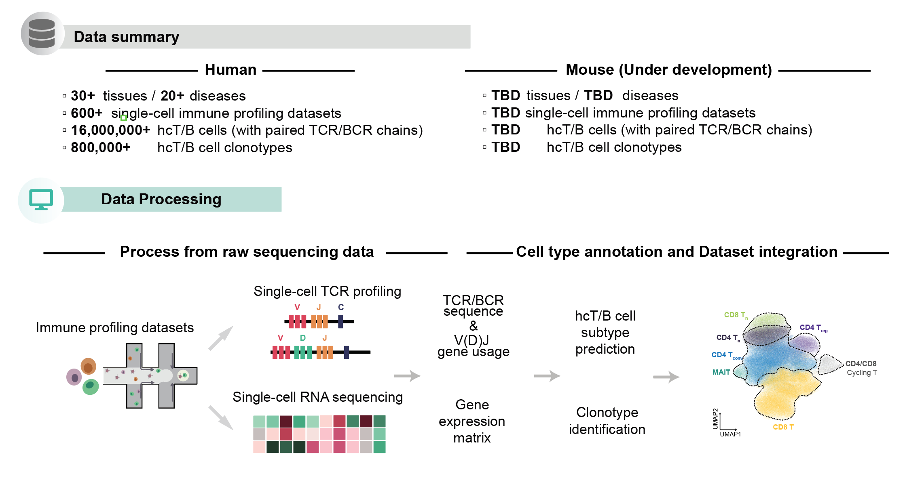
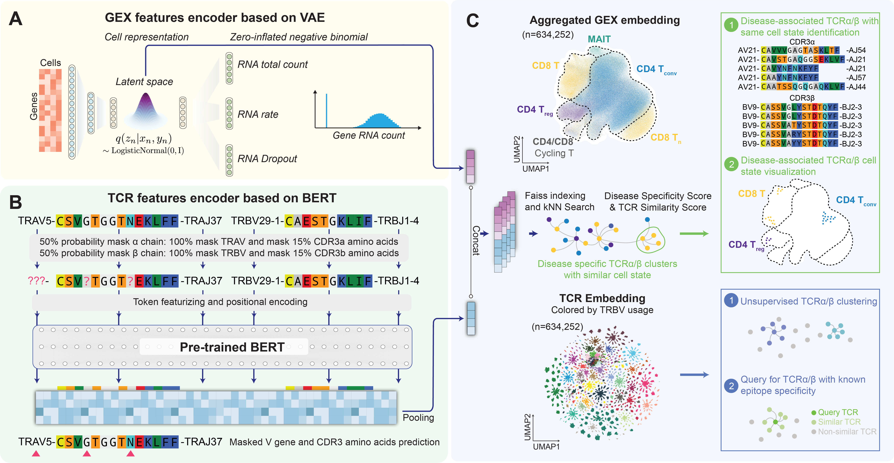

# TCR-DeepInsight

The emergence of single-cell immune profiling technology has led to the production of a large amount of data on single-cell gene expression (GEX) and T cell receptor (TCR), which has great potential for studying TCR biology and identifying effective TCRs. However, one of the major challenges is the lack of a reference atlas that provides easy access to these datasets. On the other hand, the use of TCR engineering in disease immunotherapy is rapidly advancing, and single-cell immune profiling data can be a valuable resource for identifying functional TCRs. Nevertheless, the lack of efficient computational tools to integrate and identify functional TCRs is a significant obstacle in this field.

## Aims

We have previously developed [huARdb](https://huarc.net/database) and an [updated version (v2)](https://huarc.net/v2/) currently in developing which collects single-cells immune profiling datasets including linked transcriptome and full-length TCR informations. However, one of the main obstacles in using single-cell immune profiling datasets for disease immunotherapy is the absence of a convenient reference atlas to access this information. Despite the growing potential of TCR engineering in this area, there is a significant challenge in identifying functional TCRs due to the lack of efficient computational tools to integrate the data. Nonetheless, these datasets offer a valuable resource to identify such TCRs and further advance TCR-T technology.



### Detailed collection of datasets

In 2023.2.16, we make the first release of an integrated datasets containing more than 1,000,000 hcT cells with full length TCR sequence, including the following studies. These processed an integrated data can be found at Figshare: https://figshare.com/collections/huARdb-TCR-Paper/6471289.

| **Study name**            | **Number of T cells** | **Disease**                                                  |
| ------------------------- | --------------------- | ------------------------------------------------------------ |
| [Abbas et al., 2021](https://doi.org/10.1038/s41467-021-26282-z)        | 20302                 | Acute Myeloid Leukimia                                       |
| [Azizi et al., 2018](https://doi.org/10.1016/j.cell.2018.05.060)       | 20851                 | Breast Cancer                                                |
| [Bacher et al., 2020](https://doi.org/10.1016/j.immuni.2020.11.016.)      | 39950                 | COVID-19                                                     |
| [Boland et al., 2020](https://doi.org/10.1126/sciimmunol.abb4432)       | 84076                 | Ulcerative colitis and Healthy controls                      |
| [Borcherding et al., 2021](https://doi.org/10.1038/s42003-020-01625-6)  | 8494                  | Clear cell renal cell carcinoma                              |
| [Cheon et al., 2021](https://doi.org/10.1126/sciimmunol.abk1741)      | 16271                 | COVID-19                                                     |
| [Corridoni et al., 2020](https://doi.org/10.1038/s41591-020-1003-4)    | 6915                  | Ulcerative colitis and Healthy controls                      |
| [Gao et al., 2020](https://doi.org/10.1038/s41467-022-29175-x)          | 210216                | Large granular lymphocyte leukemia and healthy controls      |
| [Gate et al., 2020](https://doi.org/10.1038/s41586-019-1895-7)         | 871                   | Healthy controls                                             |
| [He et al., 2020](https://doi.org/10.1186/s13059-020-02210-14)       | 34058                 | Healthy                                                      |
| [Kim et al., 2022](https://doi.org/10.1038/s41467-022-29539-3)          | 51343                 | Checkpoint inhibitor associated arthritis                    |
| [Krishna et al., 2021](https://doi.org/10.1016/j.ccell.2021.03.007)      | 3635                  | Clear cell renal cell carcinoma                              |
| [Liao et al., 2020](https://doi.org/10.1038/s41591-020-0901-9)         | 76477                 | COVID-19                                                     |
| [Liu et al., 2021](https://doi.org/10.1038/s41467-021-21043-4)         | 34767                 | Nasopharyngeal carcinoma                                     |
| [Lu et al., 2019](https://doi.org/10.1038/s41467-022-29539-3)           | 57220                 | Metastatic colorectal cancer                                 |
| [Luoma et al., 2020](https://doi.org/10.1016/j.cell.2020.06.001)        | 4201                  | Checkpoint inhibitor associated colitis and no colitis       |
| [Mahuron et al., 2020](https://doi.org/10.1084/jem.20192080)      | 4315                  | Melanoma                                                     |
| [Neal et al., 2018](https://doi.org/10.1016/j.cell.2018.11.021)         | 31568                 | Clear cell renal cell carcinoma                              |
| [Notarbartolo et al., 2021](https://doi.org/10.1126/sciimmunol.abg502) | 36558                 | COVID-19 and healthy controls                                |
| [Penkava et al., 2020](https://doi.org/10.1038/s41467-020-18513-6)      | 56281                 | Psoriatic arthritis                                          |
| [Ramaswamy et al., 2021](https://doi.org/10.1016/j.immuni.2021.04.003)    | 29207                 | SARS-CoV-2-associated  multisystem inflammatory syndrome and healthy controls |
| [Simone et al., 2021](https://doi.org/10.1038/s42003-021-02931-3)       | 4633                  | Ankylosing spondylitis                                       |
| [Suo et al., 2022](https://doi.org/10.1126/science.abo0516)          | 40115                 | Healthy                                                      |
| [Wang et al., 2021](https://doi.org/10.1038/s41467-021-25771-5)         | 54474                 | Kawasaki disease and healthy controls                        |
| [Wang et al., 2022](https://doi.org/10.3389/fimmu.2022.812514)         | 21664                 | COVID-19 and healthy controls                                |
| [Wen et al., 2020](https://doi.org/10.1038/s41421-020-0168-9)          | 44855                 | COVID-19 and healthy controls                                |
| [Yost et al., 2019](https://doi.org/10.1038/s41591-019-0522-3)         | 24560                 | Basal cell carinoma and squamous cell carcinoma              |
| [Zheng et al., 2020](https://doi.org/10.1038/s41467-020-20019-0)        | 20302                 | Esophagus squamous cell carcinoma                            |

### Study/Dataset being processed for the database

| **Study name**            | **Number of T cells** | **Disease**                                                  |
| ------------------------- | --------------------- | ------------------------------------------------------------ |
| [Minervina et al.](https://doi.org/10.1038/s41590-022-01184-4) | TBD | COVID-19 |
| [Poon et al., 2023](https://doi.org/10.1038/s41590-022-01395-9) | TBD | Healthy Barrier Sites |
| [Bieberich et al., 2021](https://www.frontiersin.org/articles/10.3389/fimmu.2021.701085/full) | TBD | COVID-19  |
| [Schalck et al.](https://doi.org/10.1158/2159-8290.CD-21-1248) | TBD | Pancreatic Cancer |
| [Eberhardt et al.]() | TBD | Head and neck squamous cell carcinomas  |
| [Leader et al.]() | TBD | Non-Small Cell Lung Cancer |
| [Ren et al.]() | TBD | Ovarian Cancer |
| [Shi et al.]() | TBD | Biliary Cancer | 
| [Tong et al.](https://doi.org/10.1038/s41467-022-34581-2) | TBD | Breast Cancer |

### Unpublished Datasets

| **Study name**            | **Number of T cells** | **Disease**                                                  |
| ------------------------- | --------------------- | ------------------------------------------------------------ |
| TBD | TBD | Systemic lupus erythematosus  |
| TBD | TBD | Healthy Aged Individuals |


## Introduction to TCR-DeepInsight

To robustly identify potential disease associated TCRα/β pairs considering both TCR sequence similarity and transcriptome features from million-level paired TCRα/β repertoire, we developed a deep-learning based framework named TCR-DeepInsight. 





**Hardware requirement for TCR-DeepInsight includes**
1. RAM: >16Gb for larger dataset
2. VRAM of CUDA-enabled GPU: >8Gb 


Operation System requirements for running TCR-DeepInsight include the installation of Python3 (Python3.8 used for development) and several PyPI packages. You can create a running environment using CONDA

```shell
conda create -n tcrdeepinsight python=3.8 -y    
pip3 install torch torchvision torchaudio --extra-index-url https://download.pytorch.org/whl/cu113
pip3 install faiss-gpu transformers==4.17.0 datasets==1.18.4 scikit-learn==0.24.1 scanpy==1.8.1 anndata==0.8.0 matplotlib=3.3.4 einops==0.4.1 biopython==1.79
```

## Data 

`Cellranger-6.1.2` is used for the processing of raw 10x GEX and TCR sequencing data as described in [Wu et al., 2021](https://academic.oup.com/nar/article/50/D1/D1244/6381136). However, TCR-DeepInsight is compatible with cellranger with version > 3.0.0.

Integration of GEX and TCR data is performed by `scanpy` and `scirpy`. Specifically, TCR-DeepInsight requires cells with full-length TCR and complement information of CDR3α, TRAV, TRAJ, CDR3β, TRBV, and TRBJ.

Example code for integrating and filtering GEX and TCR data:

```python
import scanpy as sc
import scirpy as ir
ir.pp.merge_with_ir(gex_adata, tcr_adata)
if isinstance(tcr_adata_opt, sc.AnnData):
    gex_adata.obs['is_cell'] = 'None'
    gex_adata.obs['high_confidence'] = 'None'
    tcr_adata_opt.obs['is_cell'] = 'None'
    tcr_adata_opt.obs['high_confidence'] = 'None'
    ir.pp.merge_airr_chains(gex_adata, tcr_adata_opt)
elif isinstance(tcr_adata_opt, Iterable):
    for i in tcr_adata_opt:
        gex_adata.obs['is_cell'] = 'None'
        gex_adata.obs['high_confidence'] = 'None'
        i.obs['is_cell'] = 'None'
        i.obs['high_confidence'] = 'None'
        ir.pp.merge_airr_chains(gex_adata, i)
ir.tl.chain_qc(gex_adata)
if self.check_valid_vdj:
    gex_adata = gex_adata[
        list(map(lambda x: x in ["single pair", "extra VJ", "extra VDJ"], gex_adata.obs["chain_pairing"]))
    ].copy()
```

## Usage

Please see the [Jupyter Notebook for TCR-DeepInsight](https://huarc.net/notebook/huARdb_TCR_DeepInsight_notebook.html).