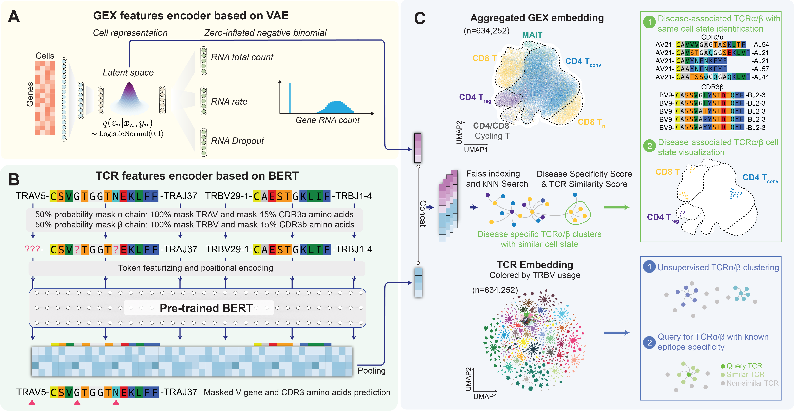

Introduction
============

The emergence of single-cell immune profiling technology has led to the production of a large amount of data on single-cell gene expression (GEX) and T cell receptor (TCR), which has great potential for studying TCR biology and identifying effective TCRs. However, one of the major challenges is the lack of a reference atlas that provides easy access to these datasets. On the other hand, the use of TCR engineering in disease immunotherapy is rapidly advancing, and single-cell immune profiling data can be a valuable resource for identifying functional TCRs. Nevertheless, the lack of efficient computational tools to integrate and identify functional TCRs is a significant obstacle in this field.
To robustly identify potential disease associated TCRα/β pairs considering both TCR sequence similarity and transcriptome features from million-level paired TCRα/β repertoire, we developed a deep-learning based framework named TCR-DeepInsight. 

Rationale
---------

For large-scale and heterogeneous scRNA-seq gene expression (GEX) data, we use an Variational Autoencoder (VAE) to capture the biological signal and regress out technical or biological batch efffects.

For full-length TCR repertoire data, we use a Transformer-based model to learn the TCR sequence features and TCR sequence similarity.

By concatenating the TCR sequence features and the GEX features, we use a faiss-based similarity search to identify the potential disease associated TCRα/β pairs. Accelerated by GPU, the faiss-based similarity search is much faster than the brute-force search.

We defined a TCR similarity score to measure the similarity of GEX and TCR within a TCR clusters. 
We also defined a disease-specificity score to measure the disease specificity of a TCR cluster.

We also provide a visualization tool to visualize the TCR sequence similarity and the GEX similarity. In the future, we will also provide a web-based interface visualization tool to visualize the TCR sequence similarity and the GEX similarity.

Installation
------------

Hardware requirement for TCR-DeepInsight includes

1. RAM: >16Gb for larger dataset
2. VRAM of CUDA-enabled GPU: >8Gb 

Operation System requirements for running TCR-DeepInsight include the installation of Python3 (Python3.8 used for development) and several PyPI packages. You can create a running environment using CONDA

.. code-block:: shell
  :linenos:

    conda create -n tcr-deep-insight -f environment.yml
    conda activate tcr-deep-insight

Usage
-----

In IPython, simply import the package to get started:

.. code-block:: python
  :linenos:
    
    import tcr_deep_insight as tdi 
    
For more details, please refer to the tutorials.

Package Features 
----------------

Update Plan  
-----------
